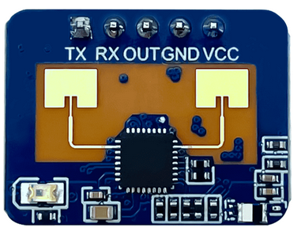

# Radar Sensor HLK-LD2410
Setup and run cheap ld2410 radar 

LD2410C is a high-sensitivity 24GHz human presence status sensing module developed by Hi-
link Electronics. Its working principle is to use FMCW frequency-modulated continuous wave to
detect human targets in the set space. Combined with radar signal processing and accurate human
body sensing algorithms, it realizes high-sensitivity human presence status sensing, and can identify
human bodies in motion and stationary states. And auxiliary information such as the distance of the
target can be calculated.
# Links

https://www.hlktech.net/index.php?id=1095
